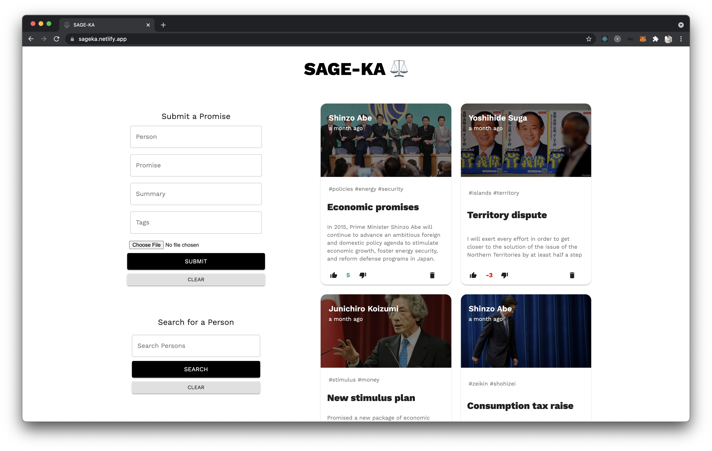

# Sageka

A simple website to keep track of promises made by politicians - inspired by Yelp!\
Please visit the site [here](https://sageka.netlify.app/)!


## Quick start

You will need to have a [MongoDB Atlas](https://www.mongodb.com/) instance ready.

```
npm install
cd client && npm start
cd server && cp .env.example
npm start
```

## Technologies used

[React](https://reactjs.org/)\
[Axios](https://axios-http.com/docs/intro)\
[Material-UI](https://material-ui.com/)\
[Moment.js](https://momentjs.com/)\
[MongoDB](https://www.mongodb.com/)\
[Mongoose.js](https://mongoosejs.com/docs/api.html)\
[Redux](https://redux.js.org/)
